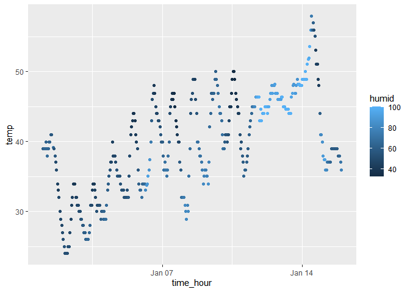

P8105 Homework 1
================
Madison Goldrich
2023-09-14

# Problem 1

Load the `moderndive` library, and load the `early_january_weather`
dataset.

``` r
library(moderndive)

data("early_january_weather")
```

## Short description of the dataset

According to the dataset help file, `early_january_weather` contains
hourly meteorological data for LGA, JFK, and EWR.

Here are the variables included in the dataset:

- `origin` is the weather station. This is EWR for all data points.
- `year`, `month`, `day`, and `hour` represent the time of the weather
  recording.
  - `year` is 2013.
  - `month` is January, represented as 1.
- `temp` and `dewp`are the temperature and dewpoint in F.
- `humid` is relative humidity.
- `wind_dir`, `wind_speed`, and `wind_gust` are wind direction (in
  degrees), speed and gust speed (in mph).
- `precip` is preciptation, in inches.
- `pressure` is sea level pressure in millibars.
- `visib` is visibility in miles.
- `time_hour` is the date and hour of the recording as a `POSIXct` date.

The size of the `early_january_weather` dataset is 358 rows by 15
columns.

The mean temperature recorded is 39.5821229 degrees Fahrenheit.

## Scatterplot

Make a scatterplot of `temp` (y) vs. `time_hour` (x); color points using
the `humid` variable (adding `color = ...` inside of `aes` in your
`ggplot` code should help).

``` r
library(tidyverse)
```

    ## ── Attaching core tidyverse packages ──────────────────────── tidyverse 2.0.0 ──
    ## ✔ dplyr     1.1.3     ✔ readr     2.1.4
    ## ✔ forcats   1.0.0     ✔ stringr   1.5.0
    ## ✔ ggplot2   3.4.3     ✔ tibble    3.2.1
    ## ✔ lubridate 1.9.2     ✔ tidyr     1.3.0
    ## ✔ purrr     1.0.2     
    ## ── Conflicts ────────────────────────────────────────── tidyverse_conflicts() ──
    ## ✖ dplyr::filter() masks stats::filter()
    ## ✖ dplyr::lag()    masks stats::lag()
    ## ℹ Use the conflicted package (<http://conflicted.r-lib.org/>) to force all conflicts to become errors

``` r
ggplot(early_january_weather, aes(x = time_hour, y = temp, color = humid)) + geom_point()
```

<!-- -->

From the scatterplot, we can see that the temperature fluctuates
throughout each day, but the temperature is generally trending upward
over the timeframe. Humidity appears to stay fairly low other than a
period of a few days where the humidity is higher. The temperature
fluctuates less during that period of higher humidity.

Export the scatterplot to the project directory.

``` r
ggsave("prob1_scatterplot.pdf")
```

    ## Saving 7 x 5 in image
